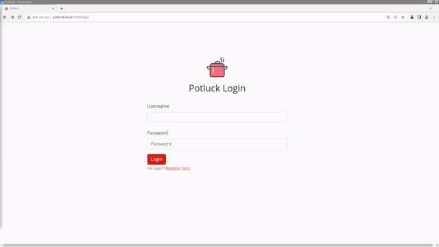
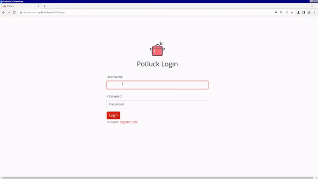
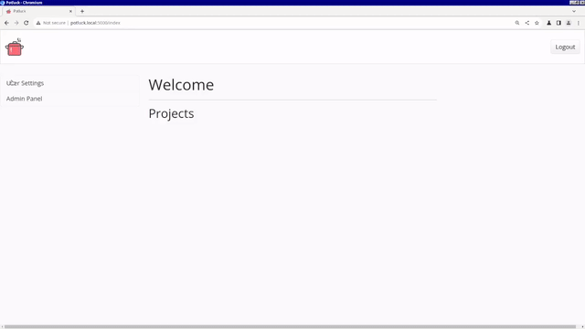
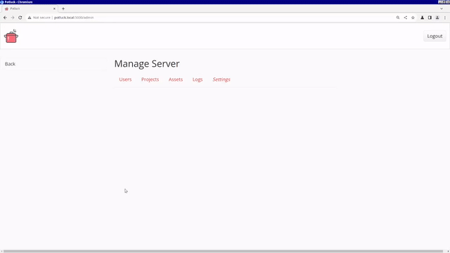
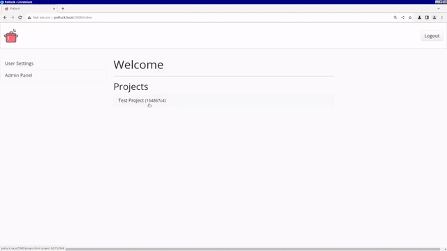
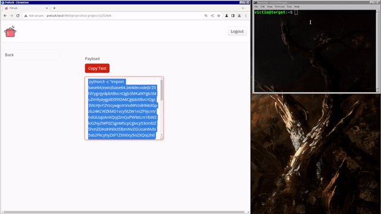
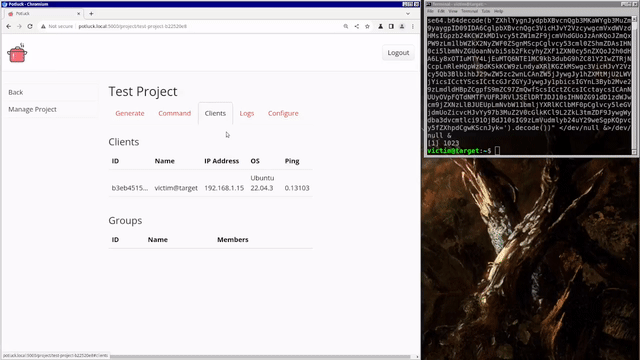

# Usage Instructions

## How to Use Potluck

1. Register a new user account by clicking "Register here" on the login page

  

2. As Admin, change the default password to something more secure

  

3. , go into the Admin Panel and create a new project

  

  - If other users have registered, add them to the project and make at least one a manager

  

4. In the project page, select the Generate tab. 
  - Payload selects the client to compile. Currently there is only a linux-based client, Ziti.
  - Architecture specifies what instruction set for the client to be compiled in.
  - Type select the dropper to be returned. Currently Potluck only returns a python3 command that the user will run on the machine they have remote access to, however it can be modified into a script that the victim runs.
  - Expiration Date sets when the client will auto-destruct without user input. This is useful to make sure any errant clients with not accidentally linger on a target's system well after a red team engagement.
  - Sleep Time sets how long the client will wait until checking for new tasks.
  - Persistence Enabled sets a flag telling the client to immediately run its persistence routine at launch. While this routine works, it's still in an early stage of development.
  - Anti VM Enabled sets a flag that will cause the client to not run if it detects a hypervisor or signs of OS-level virtualization.
5. After hitting Generate and waiting for the client to compile, the server with return the dropper command which the user can copy-paste.

  

6. When the client is spawned into the target's volatile memory, it will ping the listeners it had assigned to it. The project page might have to be refreshed for the dashboard to show up.

  

7. The user can now issue commands using the Command tab
  - Client selects which client the command will apply to. Multiple can be selected
  - Type specifies which kind of action it is
    - Command simply passes user input like it was a terminal
    - Ping causes the client to ping the listeners and update its info on the server
    - Delete initiates the self-destruct and cleanup routines.
    - Shutdown simply causes the client to exit. If persistence hasn't been enabled, this is essentially the same as Delete.
    - *Configure has yet to be implemented*

8. When the client execute commands and returns logs to the server, these can be viewed both on the dashboard and under the Logs tab. To see a more detailed view of the entries, simply click on the links in the Output column to open an API link.

  

