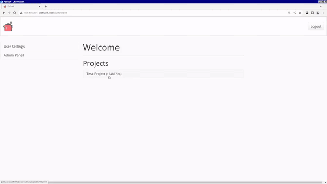

# Potluck

  

Potluck is a Linux-focused C2 suite written in Python and C++

  

## Features
- User-friendly web interface
  - Custom payload generator
  - RESTful API
  - Project dashboard made with Plotly
  - Project and user management
- Persistent client
  - Fileless dropper command
  - Virtualization detection routines
  - Expiration dates for easy cleanup
- Redundant listening posts
  - Buffers log contents
## Requirements
(Tested on Ubuntu 23.04)
- python3 (see [requirments.txt](https://github.com/jkingsec/potluck/blob/main/src/server/requirements.txt) for a more in-depth list)
- upx-ucl
- libboost-all-dev
- nlohmann-json3-dev
- gcc, g++-multilib
## Quickstart
For more in-depth instructions on how to install Potluck, please click [here](https://github.com/jkingsec/potluck/blob/main/INSTALL.md)

For more in-depth usage instruction, please click [here](https://github.com/jkingsec/potluck/blob/main/HOWTO.md)

- Install the server and at least one instance of the listener
- Login as 'admin' using the default password 'potluck123'
- Change the default password in the User settings menu
- Create a project in the Admin panel
- Create users in the Admin panel and assign them to the project
- Generate dropper scripts and payloads in the project menu
- Infect your target!
- Monitor client activity with the dashboard
